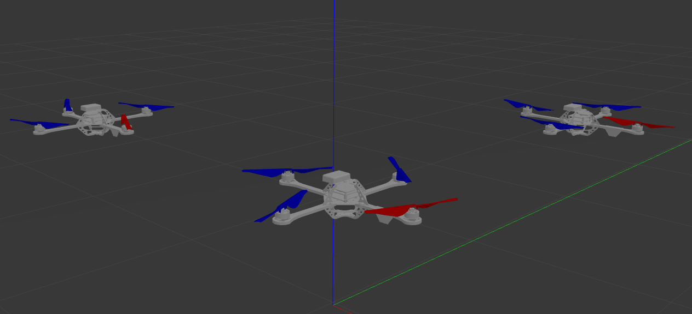
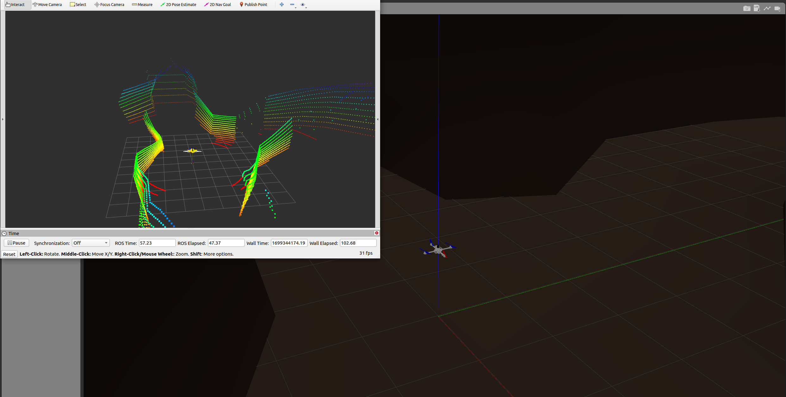

# Hummingbird Gazebo Simulator


Hummingbird is a MAV gazebo simulator modified and forked from [ethz-asl/rotors_simulator](https://github.com/ethz-asl/rotors_simulator/).

There are simulated sensors coming with the simulator such as an IMU, a generic odometry sensor, and the [VI-Sensor](http://wiki.ros.org/vi_sensor), which can be mounted on the multirotor. This package also contains some example controllers, basic worlds, and example launch files.

## Installation Instructions - Ubuntu 20.04 with ROS Noetic

1. Install additional ROS packages, catkin-tools, and wstool:

```
$ sudo apt install python3-catkin-tools
$ sudo apt install libgoogle-glog-dev
$ sudo apt install ros-noetic-octomap-ros ros-noetic-octomap-msgs
$ sudo apt install ros-noetic-mavros
```
2. If you don't have ROS workspace yet you can do so by

```
$ mkdir -p ~/catkin_ws/src
$ cd ~/catkin_ws/src
$ catkin_init_workspace  # initialize your catkin workspace
$ wstool init
$ wget https://raw.githubusercontent.com/duynamrcv/hummingbird_simulator/master/rotors_hil.rosinstall
$ wstool merge rotors_hil.rosinstall
$ wstool update
$ rm -r rotors_hil.rosinstall
```

3. Build your workspace with `python_catkin_tools` (therefore you need `python_catkin_tools`)

  ```
  $ cd ~/catkin_ws/
  $ catkin build -j4 # Use 4 threats
  ```

4. Add sourcing to your `.bashrc` file

  ```
  $ echo "source ~/catkin_ws/devel/setup.bash" >> ~/.bashrc
  $ source ~/.bashrc
  ```


## Basic Usage

Launch the simulator with a quadrotor helicopter model named Hummingbird in a basic world.

```
$ roslaunch rotors_gazebo mav_hovering_example.launch
```

> **Note** The first run of gazebo might take considerably long, as it will download some models from an online database. Should you receive a timeout error, try running gazebo by itself (e.g. roslaunch gazebo_ros empty_world.launch ) so it has sufficient time to actually download all of the models.

The simulator starts by default in paused mode. To start it you can either
 - use the Gazebo GUI and press the play button
 - or you can send the following service call.

   ```
   $ rosservice call gazebo/unpause_physics
   ```

There are some basic launch files where you can load the different multicopters with additional sensors. They can all be found in `~/catkin_ws/src/ummingbird_simulator/rotors_gazebo/launch`.

The `world_name` argument looks for a .world file with a corresponding name in `~/catkin_ws/src/hummingbird_simulator/rotors_gazebo/worlds`. By default, all launch files, with the exception of those that have the world name explicitly included in the file name, use the empty world described in `basic.world`.

### Send direct motor commands

We will for now just send some constant motor velocities to the multicopter.

```
$ rostopic pub /hummingbird/command/motor_speed mav_msgs/Actuators '{angular_velocities: [100, 100, 100, 100]}'
```

> **Note** The size of the `motor_speed` array should be equal to the number of motors you have in your model of choice (e.g. 4 in the Hummingbird model).

### Subterranean scenario for exploration 


## Original version of Rotors Simulator
Learn more and discover original version in RotorS' wiki for more instructions and examples (https://github.com/ethz-asl/rotors_simulator/wiki). Please cite the original version:
```bibtex
@Inbook{Furrer2016,
author="Furrer, Fadri
and Burri, Michael
and Achtelik, Markus
and Siegwart, Roland",
editor="Koubaa, Anis",
chapter="RotorS---A Modular Gazebo MAV Simulator Framework",
title="Robot Operating System (ROS): The Complete Reference (Volume 1)",
year="2016",
publisher="Springer International Publishing",
address="Cham",
pages="595--625",
isbn="978-3-319-26054-9",
doi="10.1007/978-3-319-26054-9_23",
url="http://dx.doi.org/10.1007/978-3-319-26054-9_23"
}
```